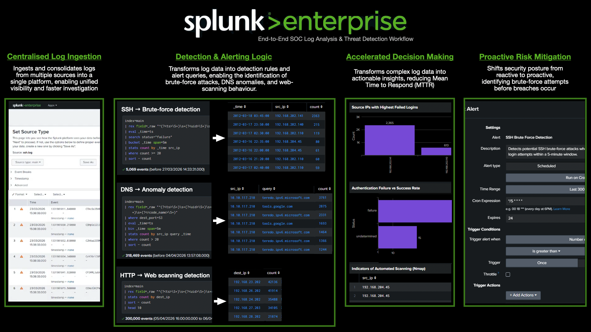

# SOC Log Analysis

A practical SOC portfolio demonstrating how raw logs are transformed into actionable security insights using Splunk SIEM.
Focused on real-world detection, investigation, and alerting workflows across SSH, DNS, and HTTP log sources.

---

## 🧠 Overview

This repository demonstrates an end-to-end SOC workflow — from ingesting raw logs to detecting threats and triggering alerts.

Instead of manually reviewing logs, this project shows how analysts:

- Ingest and centralise logs into a single platform  
- Extract fields from unstructured data using regex  
- Detect suspicious behaviour using SPL queries  
- Investigate attacker activity and patterns  
- Visualise insights through dashboards  
- Configure alerts for proactive monitoring  

The workflow reflects how real SOC teams prioritise high-risk activity, reduce noise, and respond efficiently to potential threats.

---

## 💼 Business Value

This project demonstrates how effective log analysis supports real-world Security Operations Centre (SOC) objectives and improves organisational security posture.

- **Improved Threat Detection**  
  Identifies brute-force attacks, scanning activity, and anomalous behaviour early using structured detection logic.

- **Reduced Mean Time to Detect (MTTD)**  
  Aggregated queries and dashboards enable faster identification of suspicious patterns across large volumes of logs.

- **Reduced Mean Time to Respond (MTTR)**  
  Clear visualisations and focused queries allow analysts to investigate incidents efficiently and prioritise high-risk activity.

- **Reduced Alert Fatigue**  
  Detection rules filter noisy data and highlight meaningful threats, improving signal-to-noise ratio for SOC analysts.

- **Centralised Visibility**  
  Multiple log sources (SSH, DNS, HTTP) are analysed within a single platform, providing a unified view of network activity.

- **Proactive Security Monitoring**  
  Alerts simulate real-time detection workflows, enabling early response before threats escalate into incidents.

- **Real-World SOC Workflow Alignment**  
  Demonstrates end-to-end processes including ingestion, parsing, detection, investigation, and alerting.

---

## 📊 Project Overview

| Project | Focus Area | Key Detection |
|--------|------------|--------------|
| SSH Brute Force | Authentication logs | Brute-force attacks, Nmap scanning |
| DNS Threat Detection | DNS logs | NXDOMAIN anomalies, beaconing |
| HTTP Threat Detection | Web traffic logs | Directory traversal, scanning tools |

Explore each project for detailed analysis and findings:

- [SSH Brute Force Detection](ssh-brute-force-splunk/)
- [DNS Threat Detection](dns-threat-detection-splunk/)
- [HTTP Threat Detection](http-threat-detection-splunk/)

---

## 🛠️ Tools & Technologies

- Splunk Enterprise  
- SPL (Search Processing Language)  
- Regular Expressions (regex)  
- GitHub  

---

## 🧩 Skills Demonstrated

- Log analysis and interpretation  
- Detection engineering fundamentals  
- Threat behaviour analysis  
- Dashboard visualisation  
- Alert configuration  
- Security-focused problem solving  

---

## 🎯 Why This Matters

In real-world environments, analysts cannot manually review every log entry.

This project demonstrates how detection logic, dashboards, and alerts are used to:

- Prioritise critical threats  
- Reduce investigation time  
- Enable scalable and efficient monitoring  

---

## 📎 Notes

This repository is built for learning and portfolio demonstration purposes.  
All datasets are publicly available or simulated environments.
