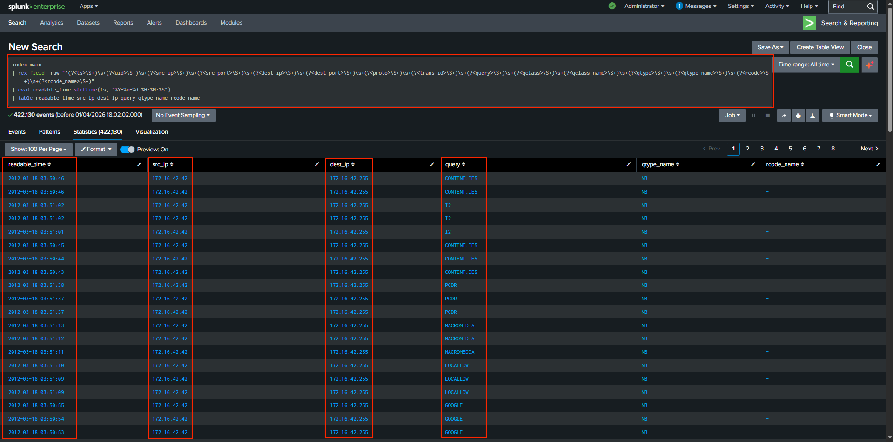
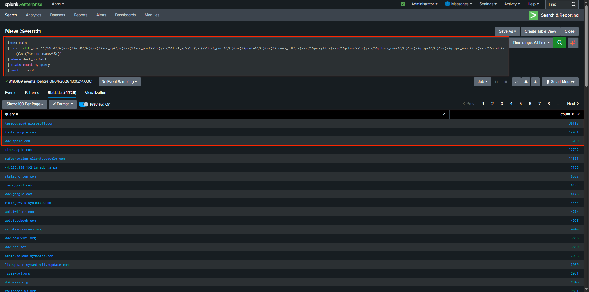
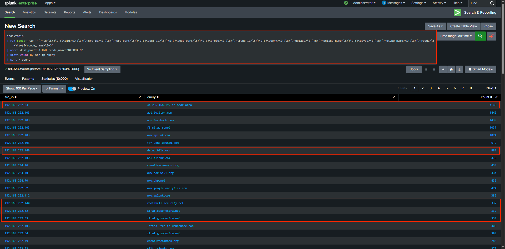
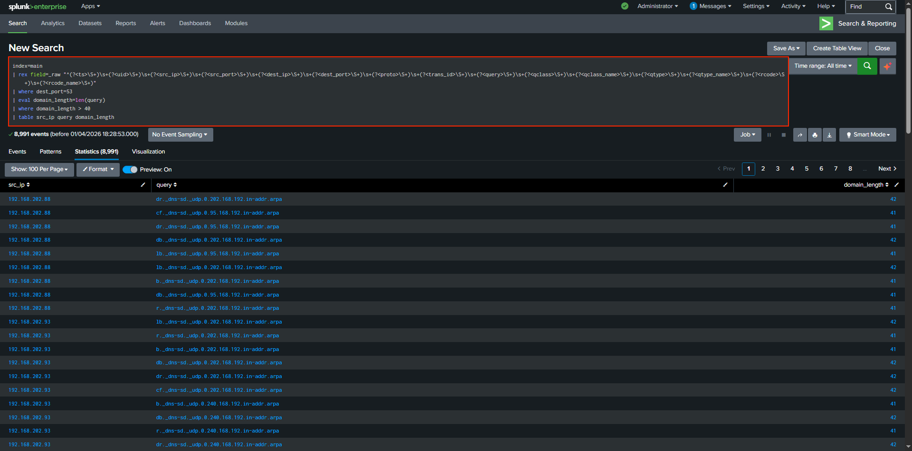
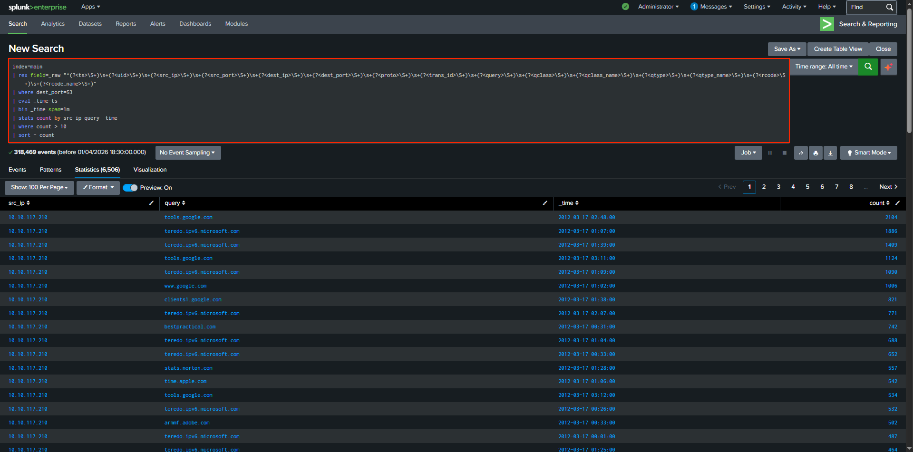
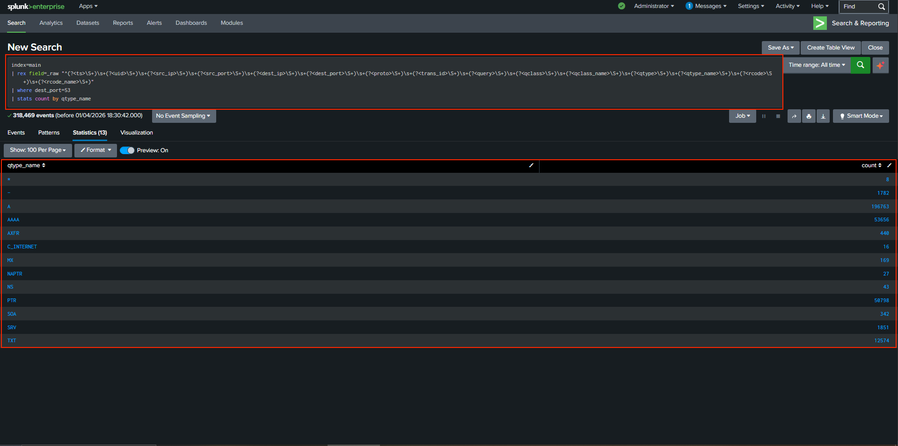
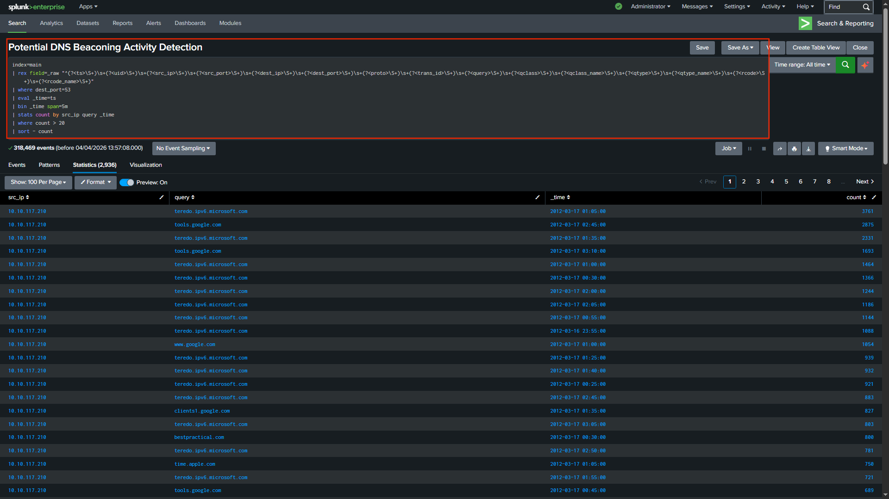
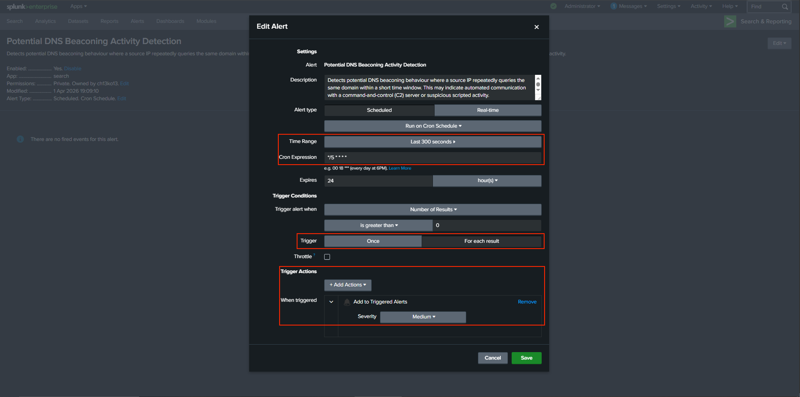
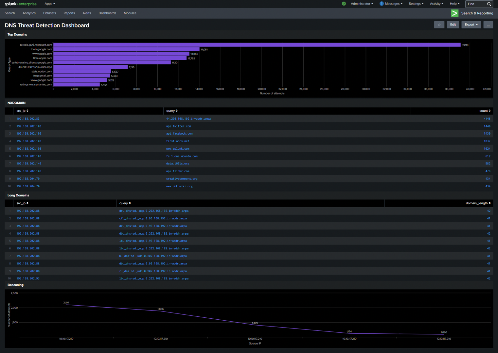

# 🌐 DNS Threat Detection using Splunk

This project demonstrates how DNS logs can be analysed using Splunk SIEM to detect suspicious activity such as domain anomalies, NXDOMAIN patterns, and potential DNS beaconing behaviour.

---

## 🧠 Project Overview

DNS (Domain Name System) logs provide visibility into how systems resolve domain names. Analysing DNS activity allows security analysts to detect abnormal behaviour such as:

- Communication with suspicious domains  
- Failed DNS resolutions (NXDOMAIN)  
- Unusual query patterns  
- Potential command-and-control (C2) communication  

In this project, raw DNS logs were ingested into Splunk, parsed using regular expressions, and analysed to identify potential threats and anomalous behaviour.

---

## 📂 Dataset

The dataset used in this project was adapted from:

* [Splunk SSH Log Analysis Project by 0xrajneesh](https://github.com/0xrajneesh/Splunk-Projects-For-Beginners/blob/main/project%234-analyzing-ssh-logs-using-splunk-siem.md)

Full credit to **Rajneesh Gupta (0xrajneesh)** for providing structured learning resources and sample datasets for Splunk log analysis projects. ([Splunk-([Splunk-Projects-For-Beginners][1])

---

## 🎯 Objectives

- Extract structured fields from raw DNS logs  
- Identify top queried domains  
- Detect NXDOMAIN (failed DNS resolutions)  
- Identify suspicious domains  
- Detect long domain names  
- Detect DNS beaconing behaviour  
- Build dashboards  
- Implement alerts  

---

## 🔍 Log Analysis Workflow

### 1. Log Ingestion

DNS logs were uploaded into Splunk using the Add Data feature.

---

### 2. Field Extraction Approach

The DNS dataset used in this project is unstructured and does not contain predefined headers. As a result, Splunk treats each log entry as raw data (`_raw`) during ingestion and does not automatically extract fields such as source IP, destination IP, or queried domain.

To address this, fields were extracted at search time using regular expressions (`rex`).

This reflects real-world SOC workflows, where analysts frequently work with unstructured logs and perform on-the-fly field extraction for investigation and threat detection.

#### 🔍 Regex Extraction Query

```spl
| rex field=_raw “^(?\S+)\s+(?\S+)\s+(?<src_ip>\S+)\s+(?<src_port>\S+)\s+(?<dest_ip>\S+)\s+(?<dest_port>\S+)\s+(?\S+)\s+(?<trans_id>\S+)\s+(?\S+)\s+(?\S+)\s+(?<qclass_name>\S+)\s+(?\S+)\s+(?<qtype_name>\S+)\s+(?\S+)\s+(?<rcode_name>\S+)”
```

This extracts structured fields such as:

- `ts` (timestamp)  
- `src_ip` (source IP)  
- `dest_ip` (destination DNS server)  
- `query` (domain requested)  
- `qtype_name` (query type)  
- `rcode_name` (response code)  

#### Regex Explanation

- `\S+` matches non-whitespace values (each column)  
- `\s+` matches spaces between fields  
- `(?<field_name>...)` creates named fields in Splunk  

This enables efficient filtering, aggregation, and detection using SPL queries.


---

## 📸 Analysis Walkthrough

### 1. Field Extraction



Raw DNS logs were parsed into structured fields for analysis.

---

### 2. Top Queried Domains



Common domains observed:

- google.com  
- apple.com  
- microsoft.com  

These indicate normal DNS activity.

---

### 3. NXDOMAIN Detection



Failed DNS queries were identified.

Suspicious domains include:

- rootshell-security.net  
- xtral.gpsonextra.net  
- data.t00ls.org  

These may indicate malicious or unknown infrastructure.

---

### 4. Long Domain Detection



Long or complex domains may indicate:

- DNS tunnelling  
- Encoded data exfiltration  

---

### 5. DNS Beaconing Detection



Source IP:

**10.10.117.210**

shows repeated queries at regular intervals, indicating automated behaviour.

---

### 6. Query Type Analysis



Most queries are:

- A  
- AAAA  
- PTR  

This provides baseline behaviour.

---

### 7. Detection Rule (Alert Query)



Detection logic:

- 5-minute window  
- Count repeated queries  
- Trigger if threshold exceeded  

---

### 8. Alert Configuration



Configuration:

- Every 5 minutes  
- Last 5 minutes window  
- Trigger when results > 0  
- Severity: Medium  

---

### 9. Dashboard



Provides visibility into:

- Top domains  
- NXDOMAIN results  
- Long domains  
- Beaconing behaviour  

---

## 📝 Incident Summary

A source IP (**10.10.117.210**) generated repeated DNS queries, indicating potential beaconing activity.

Suspicious domains were also observed, suggesting possible interaction with unknown or malicious infrastructure.

---

## ⚠️ Challenges & Limitations

- Unstructured logs required regex extraction  
- High DNS noise  
- NXDOMAIN is not always malicious  
- Detection does not confirm compromise  

---

## 🚩 Indicators of Compromise (IOCs)

### Suspicious Domains

- rootshell-security.net  
- xtral.gpsonextra.net  
- data.t00ls.org  

### Suspicious Source IP

- 10.10.117.210  

### Behavioural Indicators

- Repeated DNS queries  
- High NXDOMAIN frequency  
- Long domain queries  

---

## 🧩 Skills Demonstrated

- DNS log analysis  
- Regex extraction  
- Threat detection  
- SOC investigation workflow  
- Dashboard creation  
- Alert configuration  

---

## 🚀 Key Takeaways

- DNS logs provide strong visibility into network behaviour  
- Behaviour patterns are key indicators  
- Detection enables proactive monitoring

