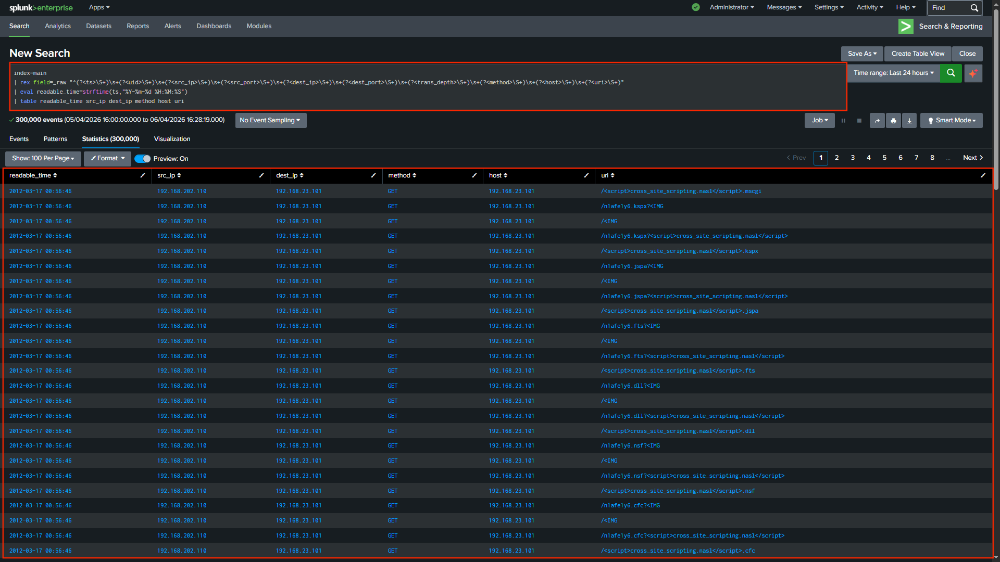
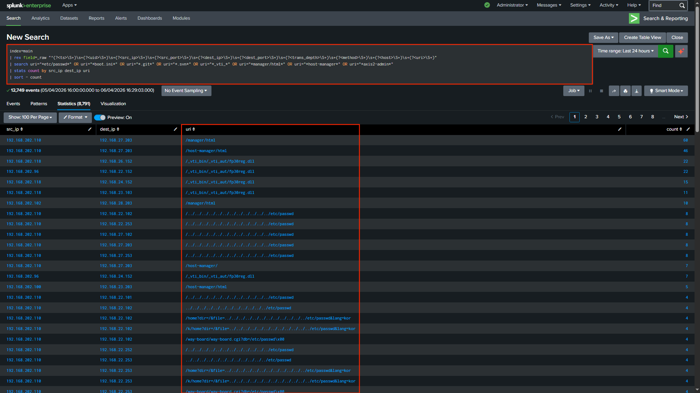
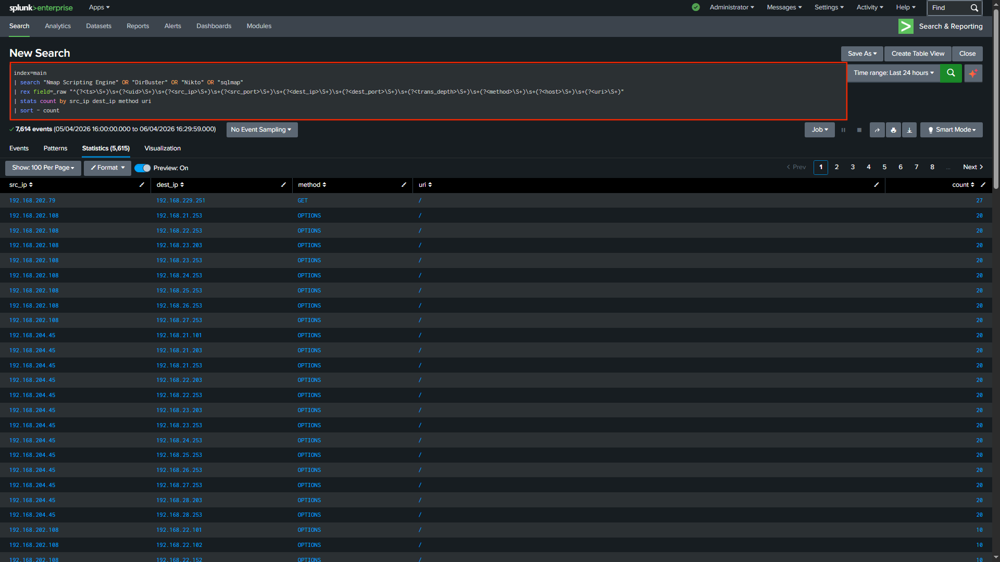
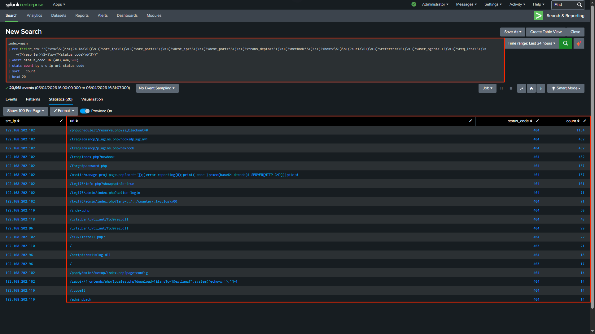
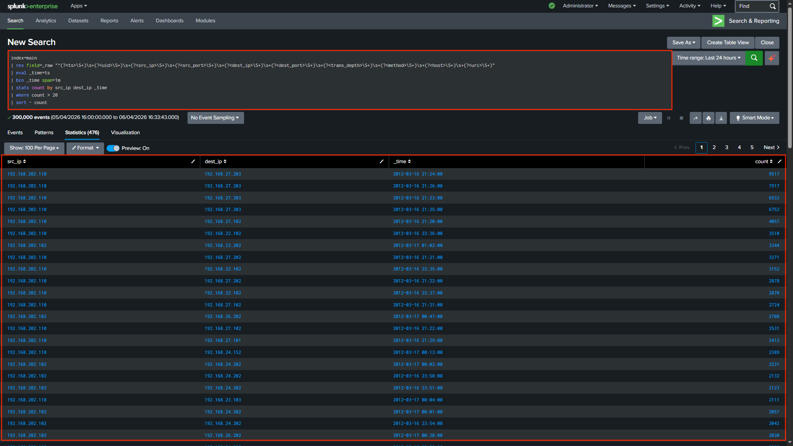
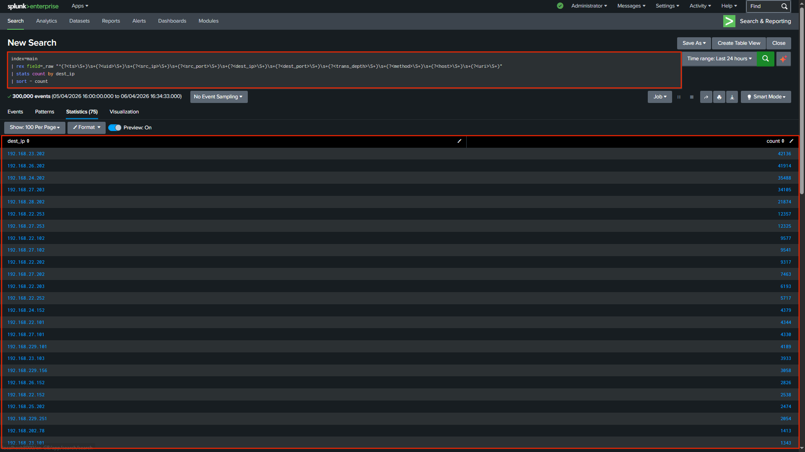
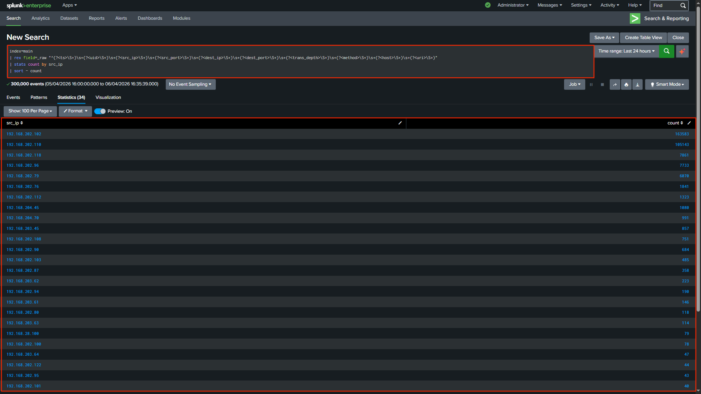
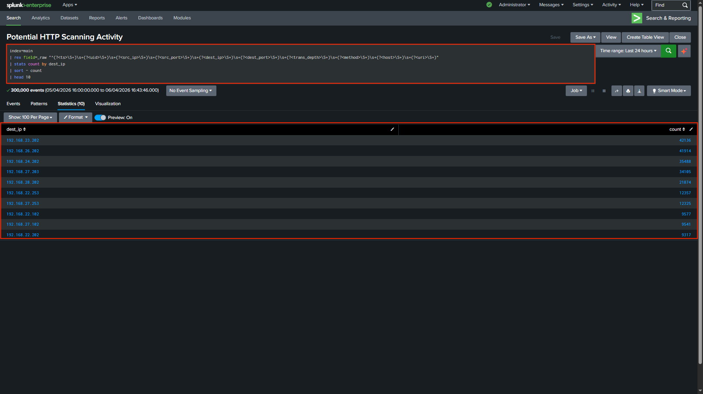
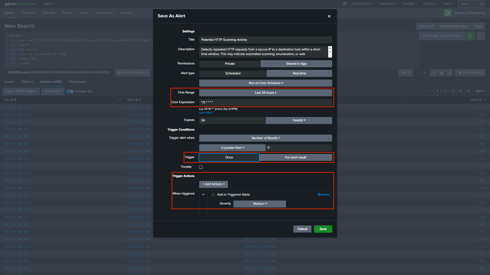
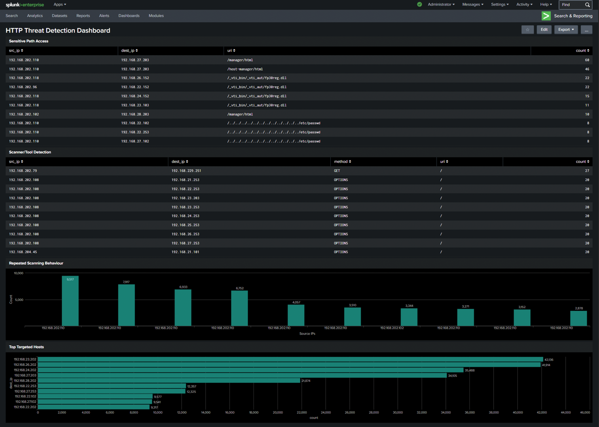

# HTTP Threat Detection using Splunk

This project demonstrates how HTTP web logs can be analysed using Splunk SIEM to detect scanning activity, identify suspicious behaviour, and simulate real-world SOC workflows.

HTTP logs provide visibility into web traffic, including requests, response codes, and access patterns. By ingesting raw logs into Splunk, extracting fields using regex, and applying detection queries, suspicious behaviour such as directory traversal attempts, automated scanning, and high-frequency request patterns can be identified.

---

## 🔍 Log Analysis Workflow

This section outlines the technical steps used to process and analyse the HTTP logs.

### 1. Log Ingestion

HTTP logs were uploaded into Splunk using the Add Data feature and indexed for analysis.

---

### 2. Field Extraction Approach

The HTTP dataset is unstructured and does not contain predefined headers. Splunk treats each log entry as raw data (`_raw`).

To enable analysis, fields were extracted at search time using regular expressions (`rex`).

This reflects real-world SOC workflows where analysts frequently parse logs dynamically.

#### 🔍 Regex Extraction Query

```spl
| rex field=_raw "^(?<ts>\S+)\s+(?<uid>\S+)\s+(?<src_ip>\S+)\s+(?<src_port>\S+)\s+(?<dest_ip>\S+)\s+(?<dest_port>\S+)\s+(?<trans_depth>\S+)\s+(?<method>\S+)\s+(?<host>\S+)\s+(?<uri>\S+)"
```

This extracts structured fields such as:

* `ts` (timestamp)  
* `src_ip` (source IP)  
* `dest_ip` (destination DNS server)  
* `method` (HTTP method)  
* `uri` (requested resource)  

#### Regex Explanation

* `\S+` matches non-whitespace values (each column)  
* `\s+` matches spaces between fields  
* `(?<field_name>...)` creates named fields in Splunk  

This enables efficient filtering, aggregation, and detection using SPL queries.

---

### 3. Detection: Sensitive Path Access

```spl
| search uri="*etc/passwd*" OR uri="*boot.ini*" OR uri="*.git*" OR uri="*.svn*" OR uri="*_vti_*" OR uri="*manager/html*" OR uri="*host-manager*" OR uri="*axis2-admin*"
| stats count by src_ip dest_ip uri
| sort - count
```

Detects attempts to access sensitive files and administrative endpoints.

---

### 4. Detection: Scanner / Tool Activity

```spl
| search "Nmap Scripting Engine" OR "DirBuster" OR "Nikto" OR "sqlmap"
| stats count by src_ip dest_ip method uri
| sort - count
```

Identifies automated scanning tools based on behaviour and signatures.

---

### 5. Detection: HTTP Error Analysis

```spl
| where status_code IN (403,404,500)
| stats count by src_ip uri status_code
| sort - count
| head 20
```

Highlights enumeration activity through HTTP error patterns.

---

### 6. Detection: Repeated Scanning Behaviour

```spl
| eval _time=ts
| bin _time span=1m
| stats count by src_ip dest_ip _time
| where count > 20
| sort - count
```

Detects high-frequency request patterns typical of automated attacks.

---

### 7. Detection: Top Targeted Hosts

```spl
| stats count by dest_ip
| sort - count
```

Identifies the most targeted systems.

---

### 8. Detection: Top Attacking Source IPs

```spl
| stats count by src_ip
| sort - count
```

Identifies the most active attackers.

---

## 📸 Analysis Walkthrough

This section follows a typical SOC workflow: Detection → Investigation → Validation → Monitoring.

---

### 1. Field Extraction



Raw HTTP logs were parsed into structured fields such as:

* src_ip  
* dest_ip  
* method  
* uri  

This enables efficient filtering, aggregation, and threat detection within Splunk.

---

### 2. Sensitive Path Access



Suspicious URI patterns were detected, including:

* `/manager/html`  
* `/host-manager/html`  
* `/etc/passwd`  

These indicate:

* Directory traversal attempts  
* Attempts to access admin panels  
* Potential reconnaissance activity  

Attempts to access `/etc/passwd` indicate potential directory traversal attacks aimed at retrieving sensitive system files.

---

### 3. Scanner / Tool Detection



User-agent strings indicate the use of automated tools such as DirBuster and Nmap, commonly used for web application enumeration.

Multiple requests were identified using HTTP methods such as:

* OPTIONS  
* GET  

High-frequency requests across multiple targets suggest:

* Automated scanning tools  
* Enumeration activity  

---

### 4. HTTP Error Analysis



Frequent HTTP error codes observed:

* 404 (Not Found)  
* 403 (Forbidden)  

This indicates:

* Resource probing  
* Directory enumeration  
* Attempted access to non-existent or restricted files  

---

### 5. Repeated Scanning Behaviour



Source IP:

**192.168.202.110**

generated a high volume of requests within short time intervals.

This pattern strongly indicates:

* Automated scanning  
* Script-based enumeration  
* Non-human behaviour  

This behaviour is considered high risk due to its association with pre-exploitation reconnaissance.

---

### 6. Top Targeted Hosts



Most targeted systems include:

* 192.168.23.202  
* 192.168.26.202  
* 192.168.24.202  

This suggests:

* Focused targeting rather than random scanning  
* Potential high-value systems being probed  

---

### 7. Top Attacking Source IPs



Top attacking sources:

* **192.168.202.102**  
* **192.168.202.110**  

These IPs generated the highest number of requests, indicating:

* Primary scanning sources  
* Potential compromised or attacker-controlled systems  

---

### 8. Detection Rule (Alert Query)



Detection logic:

* Group events into 1-minute windows  
* Count requests per source and destination  
* Trigger when threshold exceeds **20 requests**  

This helps identify abnormal request spikes.

---

### 9. Alert Configuration



Configuration:

* Schedule: Every 5 minutes  
* Time range: Last 24 hours  
* Trigger: Results > 0  
* Severity: Medium  

This enables continuous monitoring for scanning behaviour.

---

### 10. Dashboard



The dashboard provides a consolidated view of:

* Sensitive path access  
* Scanner/tool activity  
* Repeated scanning behaviour  
* Top attackers and targets  

This improves situational awareness and supports faster incident response.

---

## 📝 Incident Summary

Multiple source IPs generated extremely high volumes of HTTP requests targeting specific systems.

Indicators such as:

* Directory traversal attempts  
* Admin panel probing  
* High-frequency requests  
* HTTP error patterns  

strongly indicate automated reconnaissance and web scanning activity.

---

## 🎯 Why This Matters

HTTP traffic is a primary target for attackers, as web applications are commonly exposed to the internet. Attackers often perform reconnaissance and scanning to identify vulnerabilities before attempting exploitation.

Activities such as directory traversal attempts, automated scanning using tools like DirBuster and Nmap, and repeated requests to sensitive paths are strong indicators of pre-exploitation behaviour.

Detecting these patterns early helps prevent web application compromise, data exposure, and potential system takeover.

This project demonstrates how SOC analysts can analyse HTTP logs to identify suspicious behaviour and support proactive threat detection.

---

## ⚠️ Challenges & Limitations

* Analysis based on partial dataset may not capture full attack scope  
* Detection relies on known patterns and may miss novel techniques  
* Additional correlation with other logs is required for confirmation

---

## 🚩 Indicators of Compromise (IOCs)

### 🔺 Suspicious Source IPs

* 192.168.202.102  
* 192.168.202.110  

---

### 🔺 Targeted Hosts

* 192.168.23.202  
* 192.168.26.202  

---

### 🔺 Suspicious URIs

* /etc/passwd  
* /manager/html  
* /host-manager  

---

### 🔺 Behavioural Indicators

* High request frequency  
* Repeated requests within short intervals  
* Large number of HTTP errors  

---

## 🚀 Key Takeaways

* HTTP logs reveal attacker behaviour clearly  
* Detection logic is essential for SOC operations  
* Dashboards improve visibility  
* Alerts enable proactive monitoring 

[1]: https://github.com/0xrajneesh/Splunk-Projects-For-Beginners/blob/main/project%233-analyzing-http-logs-using-splunk-siem.md "project#3-analyzing-http-logs-using-splunk-siem.md"
[2]: https://github.com/0xrajneesh/Splunk-Projects-For-Beginners "Splunk SIEM Log Analysis Projects"
