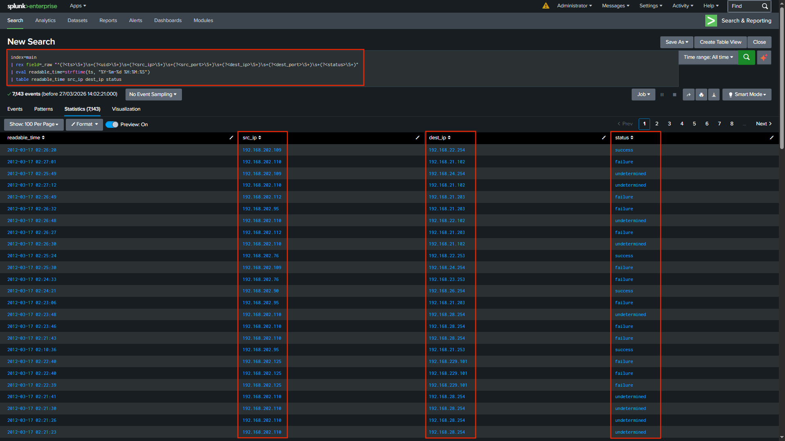
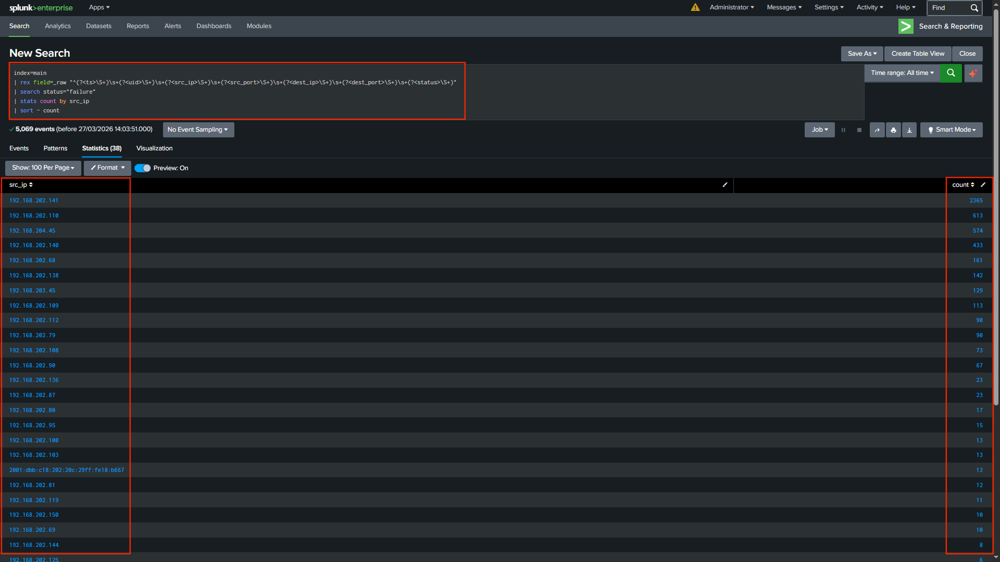
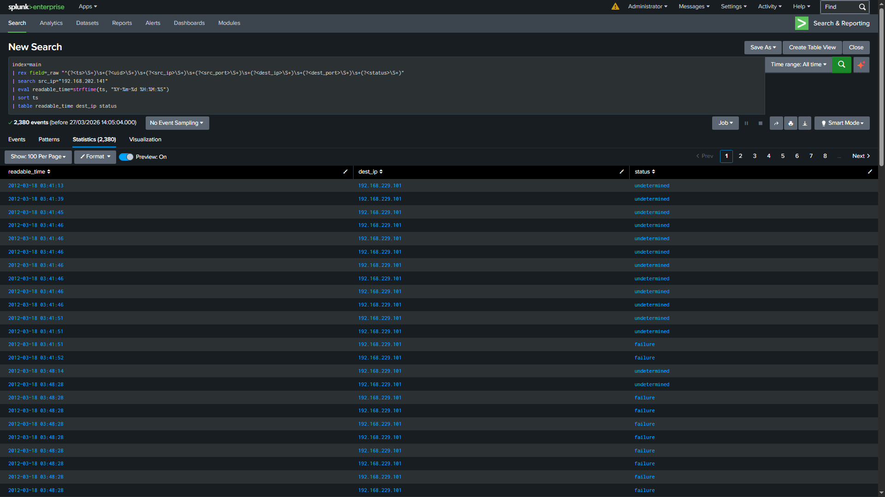
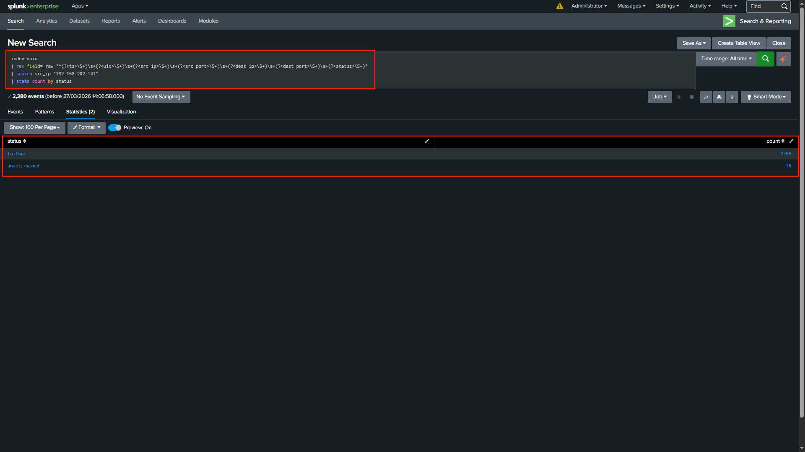
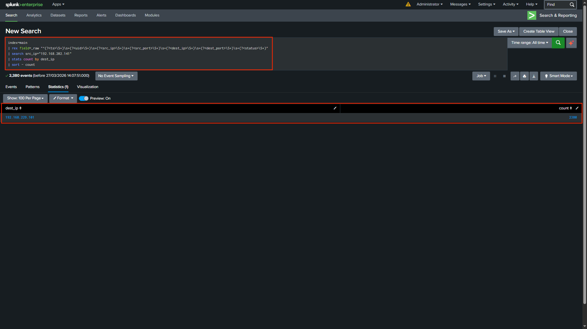
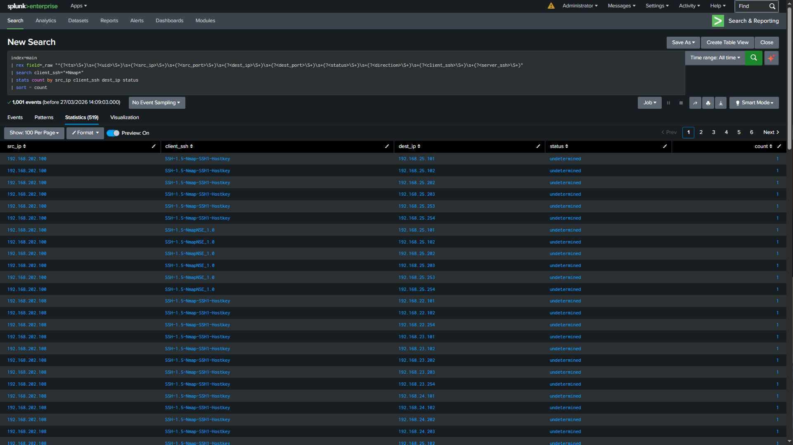
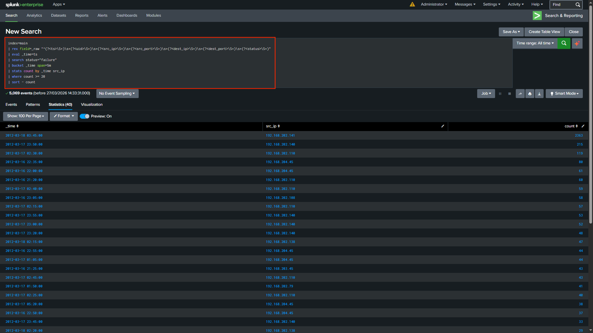
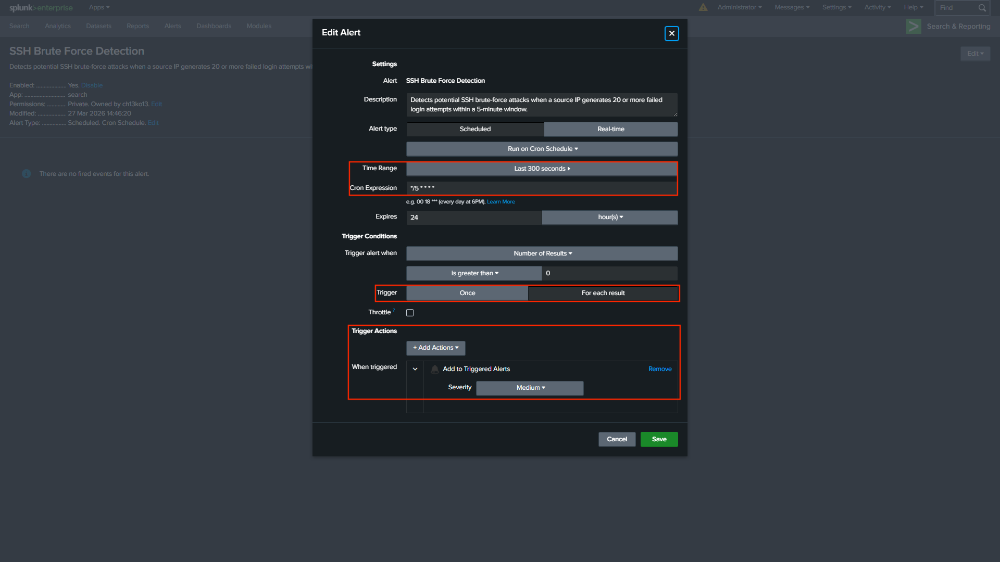
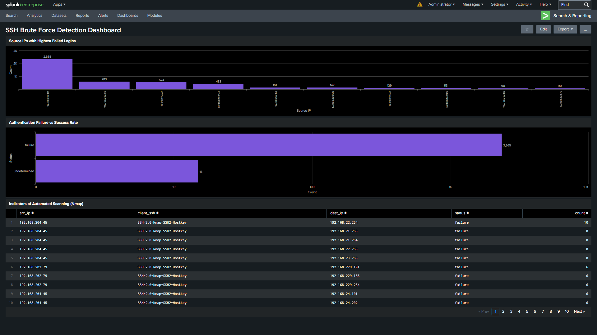

# SSH Brute Force Detection using Splunk

This project demonstrates how SSH authentication logs can be analysed using Splunk SIEM to detect brute-force attacks, identify suspicious behaviour, and simulate real-world SOC (Security Operations Centre) workflows.

---

## 🧠 Project Overview

SSH (Secure Shell) logs contain critical information about remote access attempts, including authentication successes and failures, as well as connection details. Analysing these logs allows security analysts to detect unauthorised access attempts and potential brute-force attacks. ([Splunk-Projects-For-Beginners][1])

In this project, raw SSH logs were ingested into Splunk, parsed with regular expressions, and analysed to uncover suspicious activity patterns.

---

## 📂 Dataset

The dataset used in this project was adapted from:

* [Splunk SSH Log Analysis Project by 0xrajneesh](https://github.com/0xrajneesh/Splunk-Projects-For-Beginners/blob/main/project%234-analyzing-ssh-logs-using-splunk-siem.md)

Full credit to **Rajneesh Gupta (0xrajneesh)** for providing structured learning resources and sample datasets for Splunk log analysis projects. ([Splunk-Projects-For-Beginners][2])

---

## 🎯 Objectives

* Detect high-volume failed SSH login attempts
* Identify top attacking source IP addresses
* Analyse authentication outcomes (failure vs success)
* Detect automated scanning tools (e.g. Nmap)
* Build a dashboard for visual monitoring
* Implement an alert for brute-force detection

---

## 🛠️ Tools & Technologies

* Splunk Enterprise
* SPL (Search Processing Language)
* Regular Expressions (regex)
* GitHub

---

## 🔍 Log Analysis Workflow

This section outlines the technical steps used to process and analyse the SSH logs.

### 1. Log Ingestion

SSH logs were uploaded into Splunk using the **Add Data** feature and indexed for analysis.

---

### 2. Field Extraction Approach

The SSH dataset used in this project is unstructured and does not contain predefined headers. As a result, Splunk treats each log entry as raw data (`_raw`) during ingestion and does not automatically extract fields such as source IP or destination IP.

To address this, fields were extracted at search time using regular expressions (`rex`).

This reflects real-world SOC workflows, where analysts often work with unstructured logs and perform on-the-fly field extraction for investigation and threat detection.

#### 🔍 Regex Extraction Query

```spl
| rex field=_raw "^(?<ts>\S+)\s+(?<uid>\S+)\s+(?<src_ip>\S+)\s+(?<src_port>\S+)\s+(?<dest_ip>\S+)\s+(?<dest_port>\S+)\s+(?<status>\S+)"
```

This extracts structured fields such as:
* ts (timestamp)
* src_ip (source IP)
* dest_ip (destination IP)
* status (authentication result)

Regex Explanation:
* \S+ matches non-whitespace values (each column)
* \s+ matches spaces between fields
* (?<field_name>...) creates named fields in Splunk

This enables efficient filtering, aggregation, and threat detection using SPL queries.

---

### 3. Detection: Top Attacking IPs

```spl
| search status="failure"
| stats count by src_ip
| sort - count
```

Identifies source IPs generating high volumes of failed login attempts.

---

### 4. Investigation: Source IP Behaviour

```spl
| search src_ip="X.X.X.X"
| stats count by status
```

Evaluates authentication outcomes for a specific IP.

---

### 5. Tool Detection (Nmap)

```spl
| search client_ssh="*Nmap*"
| stats count by src_ip dest_ip
```

Detects automated scanning tools based on SSH client signatures.

---

## 📸 Analysis Walkthrough

This section follows a typical SOC workflow: Detection → Investigation → Validation → Monitoring.

---

### 1. Field Extraction



Raw SSH logs were parsed using regex to extract structured fields such as `src_ip`, `dest_ip`, and `status`.

This enables efficient querying and investigation within Splunk.

---

### 2. Identifying Top Attacking Source IPs



The analysis identified **192.168.202.141** as the most active source, generating approximately **2365 failed login attempts**.

This volume is highly indicative of brute-force behaviour.

---

### 3. Investigating Suspicious Source IP



Further inspection shows repeated login attempts across multiple timestamps and systems.

No successful logins were observed, suggesting persistent but unsuccessful brute-force attempts.

---

### 4. Authentication Outcome Analysis



The overwhelming number of failures compared to successful logins reinforces the likelihood of a brute-force attack.

---

### 5. Target System Analysis



The attacker primarily targeted:

* **192.168.229.101**

This indicates a focused attack rather than broad, random scanning.

---

### 6. Detection of Automated Scanning (Nmap)



The presence of signatures such as:

* `SSH-2.0-Nmap-SSH2-Hostkey`
* `SSH-1.5-NmapNSE_1.0`

This strongly suggests the activity is automated and likely part of reconnaissance or attack preparation.

---

### 7. Brute Force Detection Query



A detection rule was created to identify brute-force activity by:

* Grouping events into 5-minute windows
* Counting failed login attempts per source IP
* Flagging IPs exceeding a threshold (≥20 attempts)

---

### 8. Alert Configuration

This alert simulates real-world SOC monitoring by detecting abnormal authentication patterns in near real-time.



The alert was configured with:

* Schedule: Every 5 minutes
* Time range: Last 5 minutes
* Trigger condition: Results > 0
* Severity: Medium

This enables proactive detection.

---

### 9. Dashboard Visualisation



The dashboard provides a consolidated view of:

* Top attacking IPs
* Authentication outcomes
* Indicators of automated scanning

This improves monitoring and incident response efficiency.

---

## 🧠 Key Findings

- **192.168.202.141** generated over **2365 failed login attempts**, indicating a likely brute-force source  
- No successful authentication events were observed, suggesting unsuccessful intrusion attempts  
- SSH client signatures linked to **Nmap** confirmed automated scanning behaviour  
- The attack was primarily focused on **192.168.229.101**, indicating targeted reconnaissance  

---

## 🚩 Indicators of Compromise (IOCs)

The following indicators were identified during log analysis and can be used for detection and threat hunting.

### 🔺 Suspicious Source IPs

* **192.168.202.141**

  * ~2365 failed login attempts
  * Primary brute-force source

---

### 🔺 Targeted Systems

* **192.168.229.101**

  * Most frequently targeted host

---

### 🔺 Behavioural Indicators

* High frequency of failed login attempts
* Rapid repeated attempts within short time intervals
* No successful authentication

---

### 🔺 Tool Indicators

* `SSH-2.0-Nmap-SSH2-Hostkey`
* `SSH-1.5-NmapNSE_1.0`

Indicates automated reconnaissance using Nmap.

---

### 🔺 Temporal Indicators

* Multiple failed attempts within 5-minute windows
* Triggered brute-force alert threshold

---

### 🔹 Conclusion

The observed activity strongly indicates **automated brute-force and reconnaissance behaviour**, rather than legitimate user access.

---

## 🧩 Skills Demonstrated

* Log ingestion and parsing
* Regex-based field extraction
* Threat detection and analysis
* SOC investigation workflow
* Dashboard creation
* Alert configuration

---

## 🚀 Key Takeaways

* Raw logs can be transformed into actionable security insights
* Detection logic is essential for identifying abnormal behaviour
* Visualisation improves situational awareness
* Alerts enable proactive monitoring in SOC environments

---


[1]: https://github.com/0xrajneesh/Splunk-Projects-For-Beginners/blob/main/project%234-analyzing-ssh-logs-using-splunk-siem.md "project#4-analyzing-ssh-logs-using-splunk-siem.md"
[2]: https://github.com/0xrajneesh/Splunk-Projects-For-Beginners?utm_source=chatgpt.com "Splunk SIEM Log Analysis Projects"

